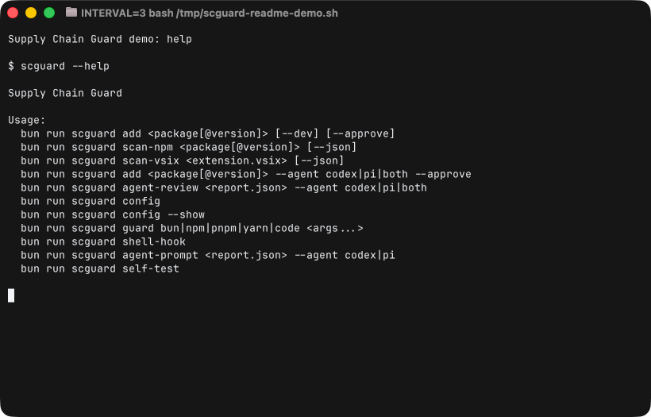
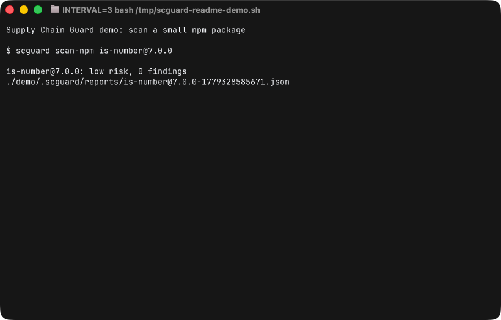
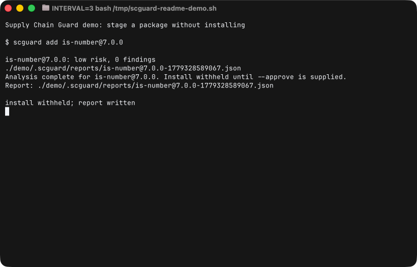
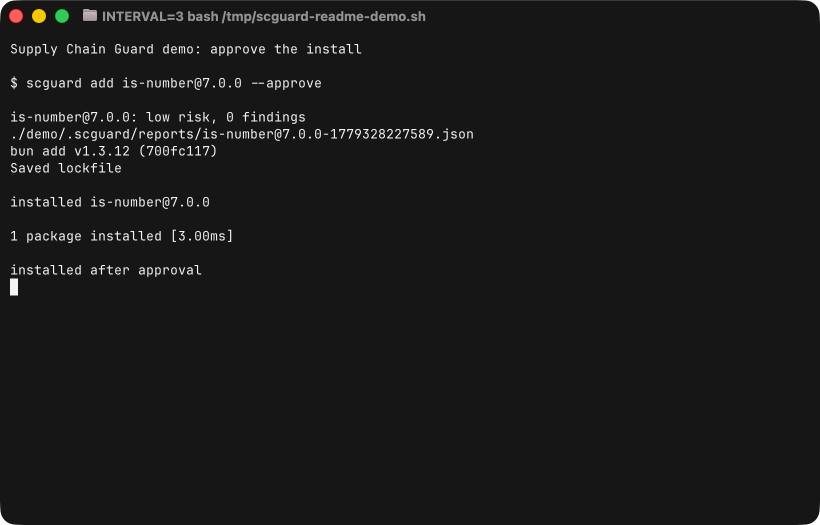
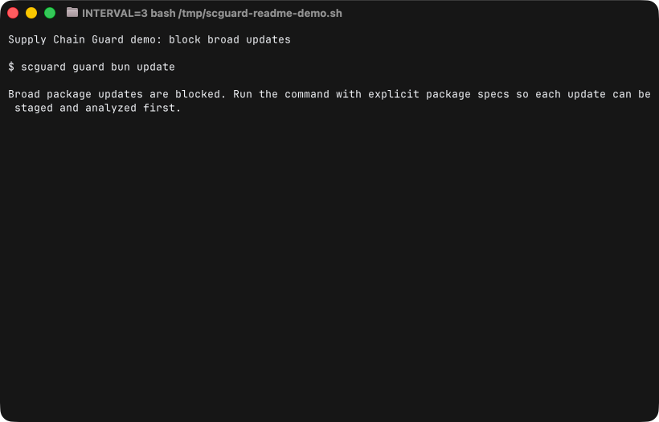
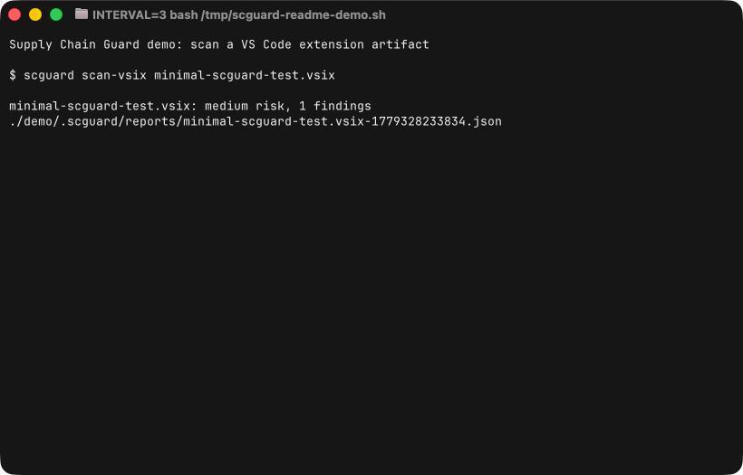
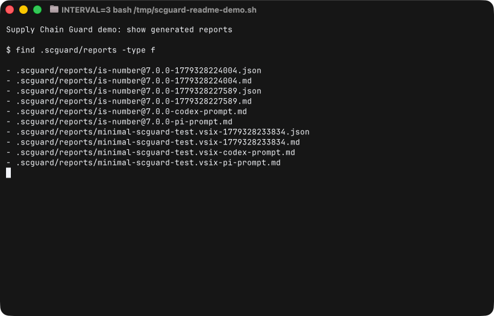
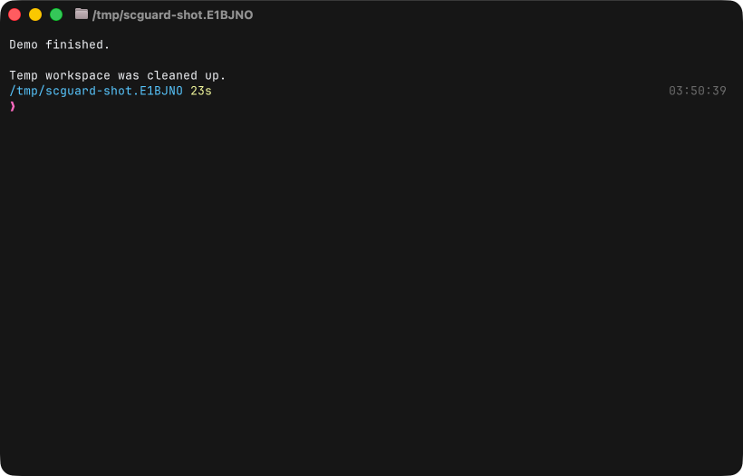

# Supply Chain Guard

Supply Chain Guard puts a local review step in front of npm packages and VS Code extensions. It downloads the artifact first, checks the files that usually matter during an install, writes JSON and Markdown reports, and can ask Codex or PI for a second review before anything lands in your project.

It is meant for the moment right before you run `bun add`, `npm install`, or `code --install-extension`. It is not a malware sandbox, and an approval is not proof that a package is safe. It is a local tripwire for suspicious install behavior.

## Install Or Update

```sh
curl -fsSL https://raw.githubusercontent.com/pc-style/supply-chain-guard/main/install.sh | bash
```

The installer is also the updater. It clones or pulls this repo into `~/.local/share/supply-chain-guard`, runs `bun install`, creates `~/.local/bin/scguard`, and opens the config menu when a TTY is available.

## Demo

The CLI is intentionally plain. `scguard --help` shows the install gate, scan, shell hook, config, and agent-review commands:



Scan a package before it is installed:



Stage a package without installing it, then approve it when the report looks clean:





Broad updates are blocked unless you name the packages to review:



VS Code extensions can be scanned from a local `.vsix` file:



Every run leaves JSON, Markdown, and agent-review prompts under `.scguard/reports`:



The demo script cleans up its temporary workspace when it finishes:



## Requirements

- Bun
- Git, `tar`, and `unzip`
- Optional: Socket API token with `packages:list`
- Optional: `codex` and/or `pi` CLIs for agent review
- Optional for npm staged publishing: npm CLI `11.15.0+` and Node `22.14.0+`

## Socket API Token

During install, you can paste a Socket API token. The installer stores it in `~/.config/supply-chain-guard/env` so scans can include Socket's package score. Create a token here:

https://socket.dev/dashboard/settings/api-tokens

Recommended Socket scopes:

- `packages:list` for current package score lookup
- `threat-feed:list` later if you want Socket-backed active attack warnings

## Commands

```sh
scguard review <package[@version]> [--agent codex|pi|both]
scguard install <package[@version]> [--dev] [--agent codex|pi|both]
scguard scan-vsix <path-to-extension.vsix> [--json]
scguard doctor
scguard clean [--reports] [--cache] [--work] [--all]
scguard config [--show] [--agent none|codex|pi|both]
scguard shell-hook
```

Advanced commands: `scguard scan-npm`, `scguard scan-stage`, `scguard guard`, `scguard agent-prompt`, `scguard agent-review`, `scguard self-test`.

`review` resolves the package tarball, downloads it to `.scguard/cache`, extracts it to `.scguard/work`, analyzes it, writes reports to `.scguard/reports`, and stops. Use `install` instead when you want the install to continue after the gate passes. `scguard add` is kept as a deprecated alias for `review`.

Add `--agent codex`, `--agent pi`, or `--agent both` when you want a required agent review before install. The agent must end with `SCGUARD_DECISION: approve`. A rejection, manual-review decision, missing decision, non-zero exit, or missing agent binary blocks the install.

Run `scguard config` to choose the default review mode for future scans and install gates: no agent, Codex, PI, or both. PI runs with `--no-tools --no-context-files`. Codex runs through `codex exec` in a read-only sandbox.

`scguard doctor` checks Bun, Git, tar, unzip, `~/.local/bin` on PATH, the shell hook, the Socket token, and the optional Codex/PI CLIs. Run it first if something looks wrong.

`scguard clean` removes generated state under `.scguard/`. Use `--reports`, `--cache`, `--work`, or `--all` to choose what to clear.

Recommended shell hook:

```sh
eval "$(scguard shell-hook)"
```

After that, normal commands such as `bun add lodash`, `pnpm add react`, `yarn add zod`, and `code --install-extension ./extension.vsix` go through the guard first. Bare `npm install`, `npm ci`, and `bun install` are blocked: scguard cannot yet verify the exact tarballs your lockfile would resolve to. Use explicit specs, or set `SCGUARD_BYPASS=1` for a single command if you really need to skip the guard.

For now, `code --install-extension publisher.name` is blocked because the VS Code CLI would download the extension before this tool can inspect it. Download the `.vsix`, scan it, then install the reviewed artifact.

## npm Staged Publishing

npm staged publishing lets maintainers review a package before it goes live. `scguard scan-stage <stage-id>` runs `npm stage download <stage-id>`, analyzes the downloaded tarball, and applies the same agent review policy.

With the shell hook active, `npm stage approve <stage-id>` is guarded. The staged package is downloaded, scanned, optionally reviewed by Codex or PI, and only then approved.

## Active Supply Chain Incident Mode

Set an advisory when Socket, npm, Microsoft, GitHub, or your own security source reports an active attack:

```sh
export SCGUARD_ACTIVE_INCIDENT="Socket reports active npm supply-chain campaign"
export SCGUARD_ACTIVE_INCIDENT_UNTIL="2026-05-22T12:00:00Z"
```

While the advisory is active, package operations are staged and analyzed. To continue, you must type:

```text
I accept the active supply-chain risk
```

If the text does not match exactly, the install or update is cancelled.

## Socket Intelligence

Set `SOCKET_API_KEY` to query Socket.dev during npm scans:

```sh
export SOCKET_API_KEY="..."
```

Reports say whether Socket was checked, skipped, or errored. If Socket returns a low supply-chain score, the guard raises the risk and can block the install.

## Development

```sh
bun install
bun run check
```

Generated cache, reports, tarballs, `node_modules`, and env files are ignored by git.

## Staging And Takedown Flow

The local staging flow is the `.scguard/cache`, `.scguard/work`, and `.scguard/reports` pipeline. Nothing is installed until analysis finishes and approval is explicit.

The takedown flow is intentionally simple in this first version:

- set `SCGUARD_ACTIVE_INCIDENT` to force explicit acknowledgement on every package operation
- remove the shell hook or unset the advisory after the incident ends
- inspect `.scguard/reports` for the packages and artifacts staged during the incident

## What It Checks

- install lifecycle scripts such as `preinstall`, `install`, and `postinstall`
- suspicious script text such as `curl | sh`, shell execution, encoded payloads, credential paths, and network fetches
- dependency volume and package metadata signals
- executable `bin` entries
- large files and unusual packed contents
- VS Code extension activation events, main/browser entry points, scripts, and dependency metadata
- Socket.dev package score when `SOCKET_API_KEY` is configured

This first version is conservative. It blocks `high` risk installs, warns at `medium`, and always leaves report artifacts behind for human or agent review.
